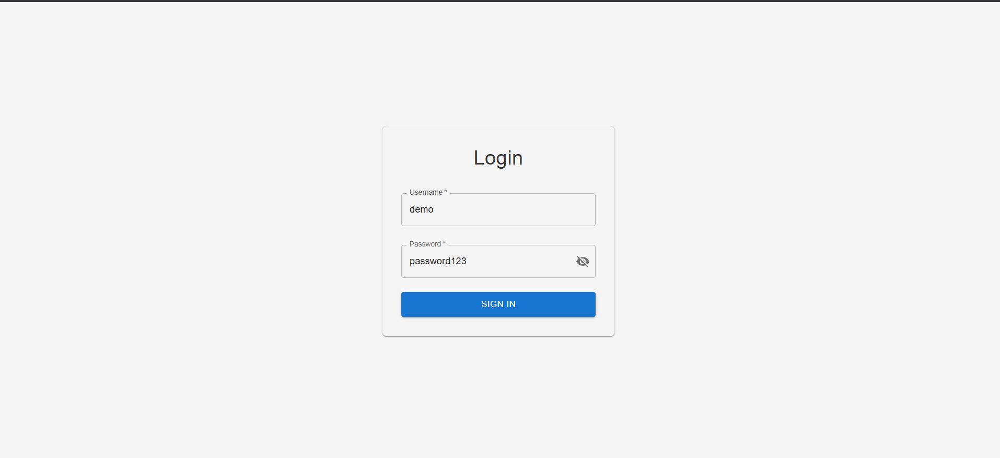
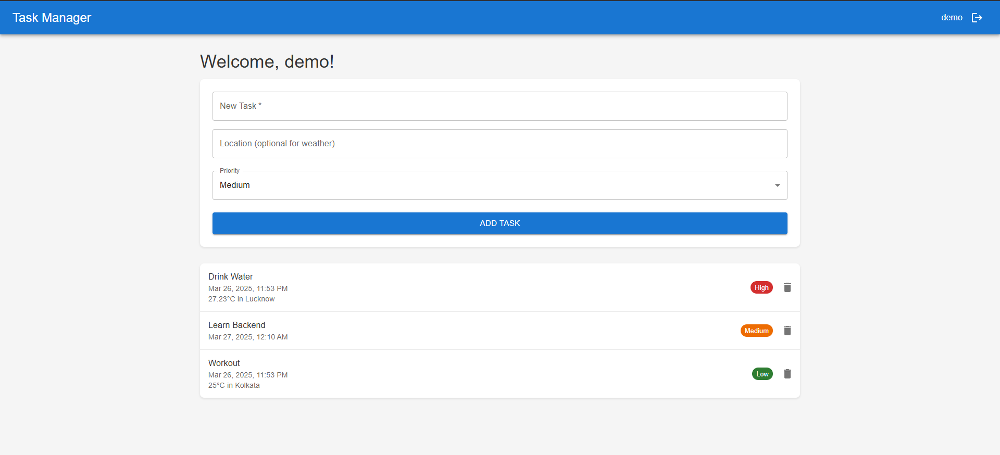
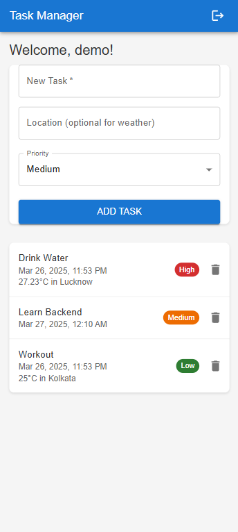

# Advanced React To-Do App with Weather Integration

A feature-rich task management application built with React, Redux, and Material-UI that integrates with weather APIs.

## 🚀 Live Demo

Check out the live version of the app here:  
👉 **[React To-Do App](https://quad-b-tech-react-js-trainee.vercel.app/)**  


## Features

✅ Task management (Create, Read Delete)  
✅ Priority system (High/Medium/Low)  
✅ Weather integration for location-based tasks  
✅ Responsive design (mobile, tablet, desktop)  
✅ User authentication (login/logout)  
✅ Local storage persistence  
✅ Modern UI with Material-UI components  

## Demo Credentials

Username: `demo`  
Password: `password123`

## Screenshots

| Login Screen | Task List | Mobile View |
|--------------|-----------|-------------|
|  |  |  |

## Technologies Used

- React 
- Redux Toolkit
- Material-UI (MUI)
- Vite
- Axios (API calls)
- date-fns (date formatting)
- React Router 

## Setup Instructions

### Prerequisites
- Node.js (v16 or higher)
- npm (v8 or higher)
- OpenWeatherMap API key (free tier)

### Installation
1. Clone the repository:
```bash
git clone https://github.com/void-57/QuadB-Tech-React-JS-Trainee.git
cd QuadB-Tech-React-JS-Trainee
```

2. Install dependencies:
```bash
npm install
```

3. Create environment file:
```bash
echo "VITE_WEATHER_API_KEY=your_api_key_here" > .env
```

4. Run the development server:
```bash
npm run dev
```

### Deployment
1. Build for production:
```bash
npm run build
```

2. Deploy to Netlify/Vercel:
- Drag-and-drop the `dist` folder to Netlify
- Or connect your GitHub repository

## Project Structure

```
src/
├── components/
│   │   ├── PrioritySelector.jsx
│   │   ├── TaskInput.jsx
│   │   ├── TaskItem.jsx
│   │   ├── TaskList.jsx
│   │   ├── WeatherInfo.jsx
│   │   ├── Auth/               # Authentication UI components
│   │        ├── PrivateRoute.jsx
│   │
├── features/
│   ├── auth/                   # Redux slice for authentication
│   │   ├── authSlice.js
│   ├── tasks/                  # Redux slice for tasks
│   │   ├── tasksSlice.js
│
├── pages/                      # Application pages
│   ├── Home.jsx
│   ├── Login.jsx
│   ├── NotFound.jsx
│
├── services/                   # Helper functions
│   ├── localStorage.js
│   ├── weather.js
│
├── styles/                     # Styling files
│   ├── main.css
│   ├── TaskInput.css
│   ├── TaskList.css
│
├── App.jsx                      # Root React component
├── main.js                      # Entry point
├── store.js                     # Redux store

```

## Available Scripts

- `npm run dev` - Start development server
- `npm run build` - Create production build
- `npm run preview` - Preview production build
- `npm run lint` - Run ESLint


